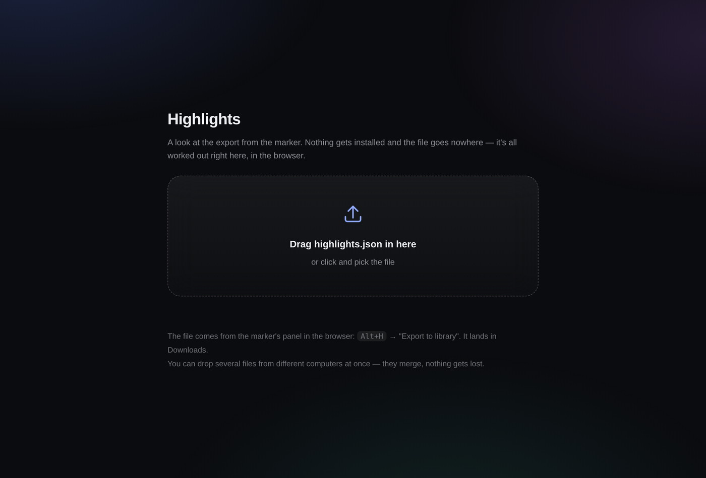

# Installing, step by step

For someone who's opened a terminal twice in their life. You can't break anything here: everything that gets installed comes off with one command, and none of it touches system folders.

Read top to bottom and stop whenever you've had enough. Each part works on its own.

---

## Part 1. The marker in the browser

Five minutes. No terminal.

### 1.1. Tampermonkey

Chrome on its own won't run other people's scripts, so it needs a middleman. Tampermonkey is that middleman, and millions of people have used it for about fifteen years.

1. Open https://www.tampermonkey.net
2. Press the big **Chrome** button
3. The extension store opens → **Install** → **Add extension**

A black and grey icon appears in the top right of the browser. If you can't see it, click the puzzle piece next to the address bar and pin Tampermonkey.

### 1.2. Allow it to run scripts

**The most important step. Skip it and nothing further works, and the browser gives you no hint why.**

Google requires that permission to run scripts is switched on separately, by hand.

**If your Chrome is recent (138 or newer):**

1. Right-click the Tampermonkey icon
2. **Manage extension**
3. Find **Allow User Scripts** and turn it on

**If that switch isn't there:**

1. Paste this into the address bar: `chrome://extensions`
2. Top right corner: the **Developer mode** switch
3. Turn it on

Chrome will sometimes nag afterwards about turning developer mode off. Don't. Just close the warning.

### 1.3. The marker itself

Open this link:

**https://raw.githubusercontent.com/abdurahhiimov/chat-marker-en/main/chat-marker.user.js**

Tampermonkey catches it and shows an install page with an **Install** button. Press it.

If you got a page of code instead, Tampermonkey didn't catch the link. In that case: Tampermonkey icon → **Dashboard** → **Utilities** tab → the **Import from URL** field at the bottom → paste the same link → **Install**.

### 1.4. Check it worked

1. Open any article: Wikipedia, a blog, a chat with Claude
2. Reload the page: **Cmd+R**
3. A round button with a counter should appear in the bottom right
4. Select any chunk of text with the mouse and the color popup shows up

Click a color. The text stays highlighted. Reload the page and the highlight is still there.

Nothing happened? Go back to step 1.2, that's nearly always what it is.

### 1.5. How to use it

| | |
|---|---|
| select with the mouse | the popup appears |
| `Alt+1` … `Alt+4` | color straight away, no popup |
| `Alt+H` | the side panel with everything you've collected |
| click a highlight | note, topic, remove |

A topic goes in the note behind a hash: "worth checking #hiring". One highlight can land in several topics.

---

## Part 2. The highlights viewer

Also no terminal. This is for looking at everything at once, with search, filters and a jump back to the original.

### 2.1. Download the file

Open the link → right-click on the page → **Save as** → put it somewhere like Documents:

**https://raw.githubusercontent.com/abdurahhiimov/chat-marker-en/main/Highlights%20Viewer.html**

One file, 30 kilobytes, everything it needs is inside.

### 2.2. Export what you've collected

In the browser: `Alt+H` → the **Export to library** button at the bottom of the panel. The file `highlights.json` lands in Downloads.

### 2.3. Look at it

Double-click `Highlights Viewer.html` → it opens in the browser → drag `highlights.json` from Downloads into the frame.



That's it. Search at the top, topics as buttons, and "to the spot" opens the original at the right paragraph.

The file sends nothing anywhere. It has no way to reach the network at all, everything happens inside the browser. You can forward it to friends without thinking about it.

Got exports from two computers? Drop both files in at once and they merge.

---

## Part 3. A library that builds itself

This one needs the terminal, but for exactly one command.

What appears: a folder where exports arrive on their own and get filed by topic, page and date. Plus an index, a spreadsheet for Google Sheets and a dashboard.

### 3.1. One command

1. Press **Cmd+Space**, type "Terminal", Enter
2. Copy the whole line, paste it (**Cmd+V**) and press Enter:

```bash
curl -fsSL https://raw.githubusercontent.com/abdurahhiimov/chat-marker-en/main/install.sh | bash
```

3. Wait. A minute or two, a bit longer if it's downloading Python.

No password. The installer says what it's doing at every step.

### 3.2. What's happening in there

**Python.** If the Mac already has one and it's recent enough, that one gets used. If not, it downloads its own into `~/.chatmarker`, which affects nothing in the system and gets deleted along with it. You don't need to install anything separately.

**Google Drive.** If you have it, the library goes there and is reachable from your phone and other computers. If not, it goes into Documents, which is also fine. Install Drive later and just run the installer again, the library moves.

**Claude Desktop.** If you have it, it gets connected (see part 4). If not, that step is skipped.

**The Documents/Chat Marker folder.** The viewer, the manual and the script itself go in there so you don't have to hunt for them. It opens on its own at the end.

### 3.3. How it goes from there

You highlight in the browser as usual. Every few days you press **Export to library**, or you press nothing and the script exports on its own every ten minutes when there's something to send.

The file lands in Downloads, the background agent picks it up, moves it into the library, backs up the previous version and rebuilds everything. About five seconds.

Start with `Index.md`. The dashboard is `Dashboard.html`, double-click it.

### 3.4. Access to Downloads (optional)

macOS won't let background programs into Downloads without explicit permission. Everything works without it, the build just doesn't happen immediately: it happens the moment you ask Claude about something.

If you want it instant:

**System Settings** → **Privacy & Security** → **Full Disk Access** → **+** → **Cmd+Shift+G** → type `~/Applications` → pick **ChatMarker Sync**.

---

## Part 4. Asking in plain words

Needs Claude Desktop, from https://claude.ai/download. If it was already installed before part 3, it's connected already.

### 4.1. Restart it

**Cmd+Q**, then open it again. Cmd+Q specifically: closing the window with the X isn't enough, the program stays in memory with the old settings.

### 4.2. Check it

Ask Claude:

> show me the stats on my highlights

It should answer with numbers: how many highlights, how many topics, where from. If it says it can't see any tools, it wasn't restarted with Cmd+Q.

### 4.3. What you can ask

> what have I collected on hiring

> put together a summary on unit economics from the green highlights

> show me the red ones from the past week

> which articles did I take the most from

If Claude Desktop went on after the installer ran, just run the command from 3.1 again.

---

## If something went wrong

**"command not found: curl"** is unlikely, curl ships with macOS. Check you copied the whole line including the `curl` at the front.

**The installer complains about the internet.** Probably a VPN or a corporate proxy. Turn the VPN off and try again.

**The marker button doesn't appear.** Part 1, step 1.2. That's the reason nine times out of ten.

**Claude doesn't see the highlights.** Cmd+Q and open it again.

**I want to see what's actually installed:**

```bash
bash ~/.chatmarker/diagnose-agent.sh
```

Shows what's installed, where the library is, whether the agent is running and what's in the log.

**I want to remove all of it:**

```bash
bash ~/.chatmarker/uninstall.sh
```

The highlights and the library stay, only the machinery goes. The script comes out of Tampermonkey by hand: icon → Dashboard → trash can.

---

## Where the data goes

Nowhere. No server, no account, no signup, nothing gets sent anywhere.

Highlights sit in the extension's storage inside your browser. The export lands in Downloads. The library is an ordinary folder on disk. Google Drive, if you have it, is used as a plain synced folder: no keys, no third-party access to the account.
