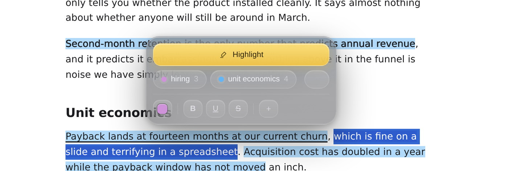
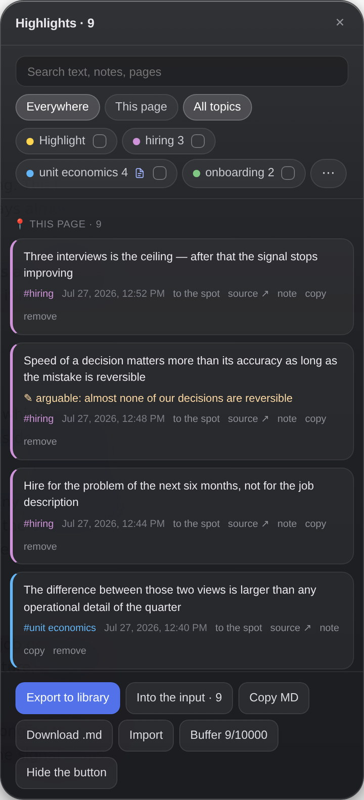
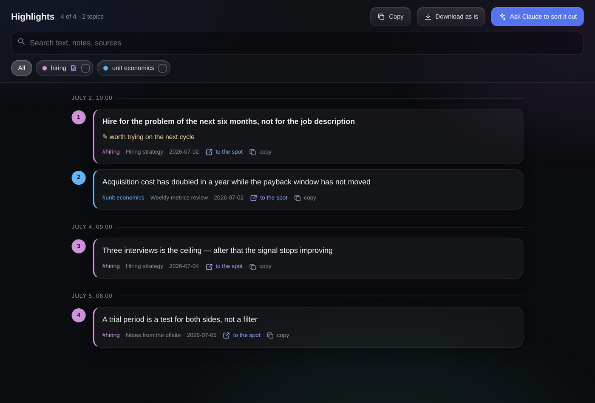
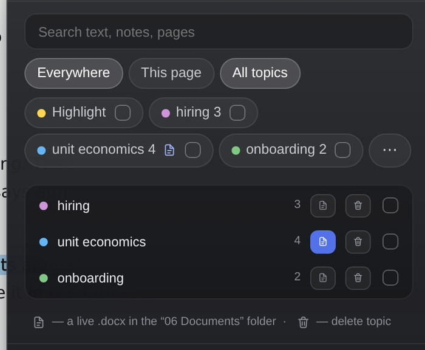

# Chat Marker

A highlighter for the browser. Mark something in a chat with an AI or in an article, and it stays marked when you come back, sorted by topic, in a library you can later just ask questions about.

Ordinary bookmarks save a whole page. This saves the actual thought, with your note on it, a topic, and a link to the exact spot where it was said.



## What it actually does

Select text with the mouse and a popup shows up with colors. Pick one, add a note and a topic if you feel like it, keep reading.

The highlight lives on the page. Close the tab, come back a week later, it's still there. Works anywhere: claude.ai, ChatGPT, documentation, news, any site with text on it.

There's a side panel with everything you've collected: search, filters by topic, jump to any highlight in one click.



After that it's three levels, and each one past the first is optional.

## Level 1. Browser only

Five minutes, no terminal at all. You get the marker and a viewer for your highlights.

**Step 1. Install Tampermonkey**, the extension that lets the browser run user scripts. [tampermonkey.net](https://www.tampermonkey.net) → the Chrome button → Install → Add extension.

**Step 2. Let it run scripts.** This is a separate step, nothing works without it, and Chrome won't explain why.

Right-click the Tampermonkey icon → Manage extension → turn on **Allow User Scripts**.

No such switch? Your Chrome is older. Then: `chrome://extensions` → top right corner → **Developer mode**.

**Step 3. Install the script itself.** Open [this link](https://raw.githubusercontent.com/abdurahhiimov/chat-marker-en/main/chat-marker.user.js) and Tampermonkey will catch it and show an Install button. Press it.

**Step 4.** Open any article and reload the page (Cmd+R). A round button appears in the bottom right. Select some text and you'll see the color popup.

**Step 5, for reading your highlights back.** Download [Highlights Viewer.html](https://raw.githubusercontent.com/abdurahhiimov/chat-marker-en/main/Highlights%20Viewer.html) (right click → Save link as). Open the file by double-clicking it and drag in `highlights.json`, the one the panel saves with **Export to library**.



Search, filters by topic, a jump back to the original, and a markdown export. The file is self-contained: it needs no internet, sends nothing anywhere, and does all its work inside the browser.

This is enough for a long time. The rest is for when you want it all filed away on its own.

## Level 2. A library that builds itself

One command in the terminal. Python, Google Drive, programming: none of it needs to be there beforehand, the installer sorts it out.

Open Terminal (Cmd+Space, type "Terminal"), paste this and hit Enter:

```bash
curl -fsSL https://raw.githubusercontent.com/abdurahhiimov/chat-marker-en/main/install.sh | bash
```

It won't ask for an admin password. Nothing touches the system: it all lives in two folders and both come off with one command.

If there's no Python on the Mac, the installer downloads its own, just for itself. If there's no Google Drive, the library goes into Documents and it says so.

What you end up with: a folder where exports arrive on their own and get filed by topic, by page and by date. Plus an index, a spreadsheet and the same dashboard, built for you this time.

```
AI Highlights/
├── 00 Inbox/         raw material
├── 01 Topics/        hiring.md, unit economics.md
├── 02 Pages/         by source
├── 04 Drafts/        your territory, the script stays out
├── 06 Documents/     a live .docx per topic you've flagged
├── Index.md          start here
├── Highlights.xlsx
└── Dashboard.html
```

Exports **merge**, they don't overwrite. You can export from two computers and lose nothing. Deleting a highlight in the browser deletes it from the library too, but a highlight pushed out of the browser's buffer stays: the library is the archive.

## Level 3. Ask in plain words

If Claude Desktop is installed, the installer connects the library to it. After that you don't have to go looking:

> what have I collected on hiring

> pull all the green highlights about unit economics into a summary

> show me the red ones, that's the stuff I meant to come back to

Claude goes into the library itself and searches by topic, color, source and date. After installing, restart Claude Desktop with **Cmd+Q**. Just closing the window isn't enough.

## Capture outside the browser: PDF, Word, Preview

Level 2 has an important add-on: [Hammerspoon](https://www.hammerspoon.org). Without it you can only highlight on web pages, and PDFs in the browser can't be highlighted at all, because Chrome draws them with no text layer. Work documents are exactly PDF and Word, so this part covers about half of real use.

Install Hammerspoon (Download, then drag it to Applications) and run `bash ~/.chatmarker/update.sh`. The config writes itself. After that, in any app: select text → `⌃⌥⌘1…4` → the highlight is in your library, tagged with which app and window it came from.

| Hotkey | What it does |
|---|---|
| `⌃⌥⌘1` | wording (yellow) |
| `⌃⌥⌘2` | idea (green) |
| `⌃⌥⌘3` | fact or method (blue) |
| `⌃⌥⌘4` | debatable, come back to it (red) |
| `⌃⌥⌘N` | capture and write a note with a topic right away |
| `⌃⌥⌘O` | open the library folder |

From Preview, a highlight also remembers the PDF page number, so the "to the spot" link in the dashboard opens the document right on it.

Why three modifier keys instead of Alt plus a digit: Alt+1…4 is already taken by the browser marker. Shorten it and the browser side breaks, quietly.

The first time you run it, Hammerspoon asks for Accessibility permission. Without it the hotkeys do nothing. That's normal, grant it once.

## Living with it

You mark things as you read, without stopping. Every few days you press **Export to library** in the panel, and there's a counter next to it showing how many haven't gone yet. From there you either drop the file into the viewer or, on level 2, it makes its own way into the library.

The export has to land in the Downloads folder itself or one level down (`Downloads/Highlights`, say). The automation doesn't look any deeper. Instant pickup by the background agent only works for the root of Downloads; from a subfolder, files get collected at the next build or the next time you ask Claude something.

Hotkeys: `Alt+1…4` for color without taking your hands off the keyboard, `Alt+H` for the side panel.

Topics: write a note with a hash in it, "worth checking #hiring", and the highlight lands in that topic. In the panel, topics become filters, and the ones you already use sit under the note field so you don't have to remember how you phrased it.



## Where the data goes

Nowhere. Highlights sit in the extension's storage inside your browser, the export lands in Downloads, the library is a folder on your disk (or in your own Google Drive, if you have it). This thing has no server, no account and no signup.

Google Drive gets used as an ordinary synced folder. No OAuth, no keys, no third-party access to the account.

## If something isn't working

**No button showed up.** The tab wasn't reloaded after installing the script. If it's still empty after Cmd+R, then Allow User Scripts (step 2) is almost certainly off.

**A highlight disappeared after a reload.** The text on the page changed, which happens on sites with a lot of movement. The highlight isn't lost, it's in the panel and in the export, it just couldn't be painted onto the new text.

**Claude doesn't see the library.** It wasn't restarted with Cmd+Q. To check the server is registered: `cat "$HOME/Library/Application Support/Claude/claude_desktop_config.json"`

**The library isn't updating.** Run the build by hand and read the error: `~/.chatmarker/venv/bin/python ~/.chatmarker/library.py`

**Something else.** `bash ~/.chatmarker/diagnose-agent.sh` shows what's installed, what isn't and where it broke.

## Update and remove

```bash
bash ~/.chatmarker/update.sh      # get the current version
bash ~/.chatmarker/uninstall.sh   # remove everything it installed
```

Removing doesn't touch the library of highlights or the Documents/Chat Marker folder. The script comes out of Tampermonkey by hand, from the extension's dashboard.

## What's inside

| | |
|---|---|
| `chat-marker.user.js` | the marker itself, the script for Tampermonkey |
| `Highlights Viewer.html` | the standalone viewer, works with nothing else installed |
| `install.sh` | the installer for levels 2 and 3 |
| `scripts/library.py` | the library builder |
| `scripts/highlights_mcp.py` | the bridge to Claude Desktop |
| `docs/Chat Marker — manual.html` | the full manual with screenshots |
| `extras/chatmarker.skill` | a skill for Claude with the project's context, if you plan to work on it |

The step-by-step version for anyone who's seen a terminal twice is in [INSTALL.md](INSTALL.md).

## Requirements

macOS for levels 2 and 3. Level 1 runs on any system and any Chromium browser with Tampermonkey: Chrome, Arc, Edge, Brave, Vivaldi. On Safari, see [docs/Safari.md](docs/Safari.md).

## License

MIT. Do what you like.
